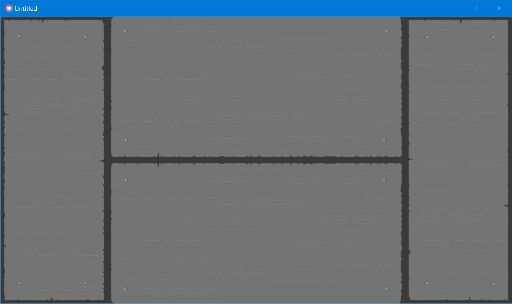
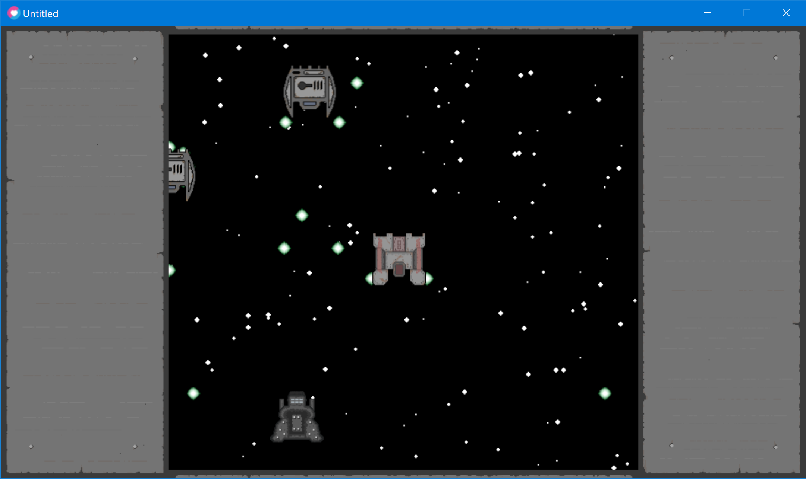

# shmup-menu

## A basic shmup including:
- player, enemies and bullets
- UI that "opens" during play and is "closed" when paused

## Controls:
- movement - wsad
- shoot - space
- pause/unpause - m
- exit - esc

